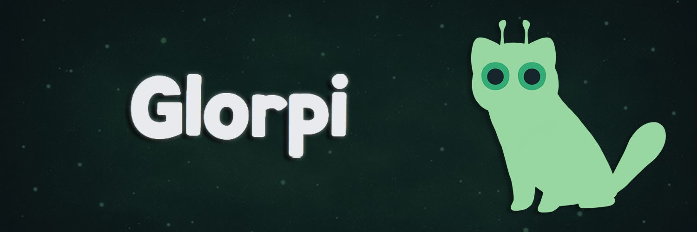

  

# Glorpi

A visual prompt builder for crafting production-ready AI prompts.

## Overview

Glorpi is a studio environment for building, validating, and testing prompts across multiple AI providers. It provides modular prompt construction with real-time token estimation and cost calculation.

## Features

- Visual prompt builder with modular blocks (system, role, constraints, examples, etc.)
- Real-time token estimation with per-block breakdown
- Cost calculator for supported providers
- Preflight validation for prompt issues
- Multi-provider support: Claude, GPT, Gemini, DeepSeek, OpenAI-compatible endpoints
- Companion chat assistant for prompt crafting
- Live2D character companion

## Tech Stack

- Next.js 14 (App Router)
- TypeScript
- Tailwind CSS
- Radix UI / shadcn/ui
- Framer Motion
- PixiJS / pixi-live2d-display
- Vitest

## License

MIT

    

